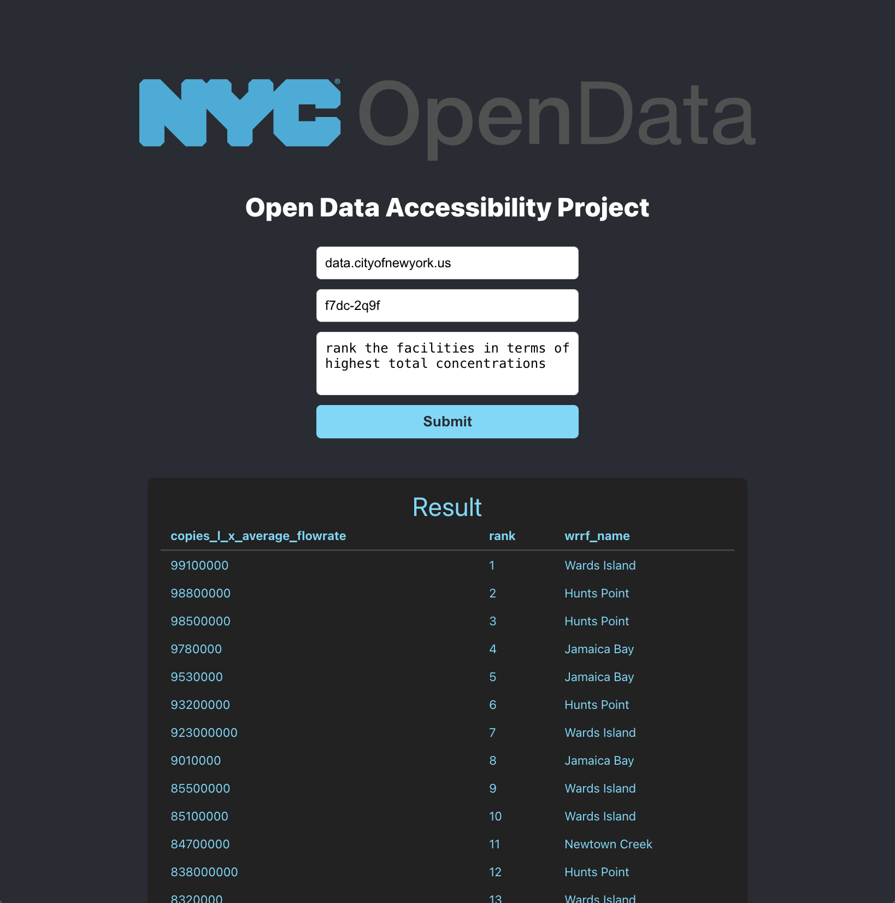

# Open Data Accessibility Project

A web application that makes open data more accessible by allowing users to interact with public datasets through a user-friendly interface. Users can query datasets by selecting a specific domain and dataset code, and ask questions in natural language. These questions are automatically translated into SQL queries, to allow users to retrieve relevant data without any technical knowledge. 



#### Future Steps
- Implement a chatbot to narrow down dataset and query; asks questions to clarify what the query should return and find relevant datasets from a list of all open datasets
- Improve prompt to decrease error rate
- Switch to a model with more parameters
- Standardize SQL dialect between SQLCoder and DuckDB

Built for build4good Hackathon 2025.

## Installation

#### Prerequisites

- [Node.js](https://nodejs.org/)
- [Python 3.x](https://www.python.org/)
- [pip](https://pip.pypa.io/en/stable/)

Clone the Repository

```bash
git clone https://github.com/swang484/opendataaccessibility.git
cd opendataaccessibility
```

Backend Setup (Flask)

```bash
cd backend
python -m venv venv
source venv/bin/activate  # On Windows: venv\Scripts\activate
pip install -r requirements.txt
python app.py  # or flask run
```

Frontend Setup (React)

```bash
cd ../frontend
npm install
npm start
```

### Technologies

- Frontend: React, JavaScript, HTML/CSS, Axios
- Backend: Flask, Python, Ollama, SQLCoder, DuckDB